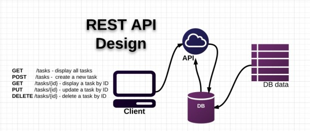

# RESTful API 设计规范



  做出一个好的API设计很难。API表达的是你的数据和你的数据使用者之间的契约，因此API的设计
  往往是站在使用者的角度进行的，而关于RESTful的介绍可以参考阮一峰的博客[理解RESTful架构
](http://www.ruanyifeng.com/blog/2011/09/restful.html), 这里同时也参考了他的另一篇博客
[RESTful API 设计指南](http://www.ruanyifeng.com/blog/2014/05/restful_api.html)
  在这方面有一篇很出名的文章，这里需要你自己解决翻墙问题[Principles of good RESTful API Design](https://codeplanet.io/principles-good-restful-api-design/)


## 定义

   这里有一些非常重要的术语，我将在本文里面一直用到它们

  + 资源(Resource)：一个对象的单独实例，如一只动物
  + 集合(Collection)：一群同种对象，如动物
  + HTTP：跨网络的通信协议
  + 客户端(Consumer)：可以创建HTTP请求的客户端应用程序
  + 第三方开发者(Third Party Developer)：这个开发者不属于你的项目但是有想使用你的数据
  + 服务器(Server)：一个HTTP服务器或者应用程序，客户端可以跨网络访问它
  + 端点(Endpoint)：这个API在服务器上的URL用于表达一个资源或者一个集合
  + 幂等(Idempotent)：无边际效应，多次操作得到相同的结果
  + URL段(Segment)：在URL里面已斜杠分隔的内容

## 数据设计与抽象

+ 理清业务数据流程
    
    规划好你的API的外观要先于开发它实际的功能。首先你要知道数据该如何设计和核心服务/应用程序会如何工作, 这部分的工作
    往往就是需要写好 PRD和DRD这些功能文档

+ 站在使用者的角度进行合理抽象
    
    有时候一个集合可以表达一个数据库表，而一个资源可以表达成里面的一行记录，但是这并不是常态。事实上，你的API应该尽可能
    通过抽象来分离数据与业务逻辑。这点非常重要，只有这样做你才不会打击到那些拥有复杂业务的第三方开发者，
    否则他们是不会使用你的API的。

+ 如何开放API
    
    当然你的服务可能很多部分是不应该通过API暴露出去的。比较常见的例子就是很多API是不允许第三方来创建用户的。

## HTTP 动词

一个好的RESTful API只允许第三方调用者使用这四个半HTTP动词进行数据交互，并且在URL段里面不出现任何其他的动词。
一般来说，GET请求可以被浏览器缓存（通常也是这样的）。例如，缓存请求头用于第二次用户的POST请求。
HEAD请求是基于一个无响应体的GET请求，并且也可以被缓存的。
    
+ GET (选择)：从服务器上获取一个具体的资源或者一个资源列表。
+ POST （创建）： 在服务器上创建一个新的资源。
+ PUT （更新）：以整体的方式更新服务器上的一个资源。
+ PATCH （更新）：只更新服务器上一个资源的一个属性。
+ DELETE （删除）：删除服务器上的一个资源。
+ HEAD ： 获取一个资源的元数据，如数据的哈希值或最后的更新时间。
+ OPTIONS：获取客户端能对资源做什么操作的信息。


## 域名

  域名是用于访问你的API服务的第一步，因此如何在域名上表现自己提供的API 服务喃，以下有2种方法

  + 应该尽量将API部署在专用域名之下。
  
  + 如果确定API很简单，不会有进一步扩展，可以考虑放在主域名下。
  
  ```
https://api.example.com   # 专业域名
https://example.org/api/  # URI中明确说明
```

## 版本化

  API是服务器与客户端之间的一个公共契约。如果你对服务器上的API做了一个更改，并且这些更改无法向后兼容，
  那么你就打破了这个契约，客户端又会要求你重新支持它。为了避免这样的事情，你既要确保应用程序逐步的演变，
  又要让客户端满意。那么你必须在引入新版本API的同时保持旧版本API仍然可用。

  随着时间的推移，你可能声明不再支持某些旧版本的API。申明不支持一个特性并不意味着关闭或者破坏它。
  而是告诉客户端旧版本的API将在某个特定的时间被删除，并且建议他们使用新版本的API。
  
  如果你只是简单的增加一个新的特性到API上，如资源上的一个新属性或者增加一个新的端点，你不需要增加API的版本。
  因为这些并不会造成向后兼容性的问题，你只需要修改文档即可。
  
  这里实现方式有2种：
  
  + 应该将API的版本号放入URL
  
  + 将版本号放在HTTP头信息中，但不如放入URL方便和直观, Github采用的就是这种做法
  
  ```
  https://api.example.com/v1/                       # 在URL中说明
  
  curl -i https://api.github.com/users/octocat/orgs # HTTP头中表示API版本

    HTTP/1.1 200 OK
    Server: nginx
    Date: Fri, 12 Oct 2012 23:33:14 GMT
    Content-Type: application/json; charset=utf-8
    Connection: keep-alive
    Status: 200 OK
    ETag: "a00049ba79152d03380c34652f2cb612"
    X-GitHub-Media-Type: github.v3
    
    X-RateLimit-Limit: 5000
    X-RateLimit-Remaining: 4987
    X-RateLimit-Reset: 1350085394
    
    Content-Length: 5
    Cache-Control: max-age=0, private, must-revalidate
    X-Content-Type-Options: nosniff
  ```
  
## API ROOT URI

  API的根地址很重要。可以通过这个列表快速了解你提供的服务，因此，让你的API根入口点保持尽可能的简单。以github的列

```
maojun@maojun-mbp# curl https://api.github.com
{
  "current_user_url": "https://api.github.com/user",
  "current_user_authorizations_html_url": "https://github.com/settings/connections/applications{/client_id}",
  "authorizations_url": "https://api.github.com/authorizations",
  "code_search_url": "https://api.github.com/search/code?q={query}{&page,per_page,sort,order}",
  "emails_url": "https://api.github.com/user/emails",
  "emojis_url": "https://api.github.com/emojis",
  "events_url": "https://api.github.com/events",
  "feeds_url": "https://api.github.com/feeds",
  "followers_url": "https://api.github.com/user/followers",
  "following_url": "https://api.github.com/user/following{/target}",
  "gists_url": "https://api.github.com/gists{/gist_id}",
  "hub_url": "https://api.github.com/hub",
  "issue_search_url": "https://api.github.com/search/issues?q={query}{&page,per_page,sort,order}",
  "issues_url": "https://api.github.com/issues",
  "keys_url": "https://api.github.com/user/keys",
  "notifications_url": "https://api.github.com/notifications",
  "organization_repositories_url": "https://api.github.com/orgs/{org}/repos{?type,page,per_page,sort}",
  "organization_url": "https://api.github.com/orgs/{org}",
  "public_gists_url": "https://api.github.com/gists/public",
  "rate_limit_url": "https://api.github.com/rate_limit",
  "repository_url": "https://api.github.com/repos/{owner}/{repo}",
  "repository_search_url": "https://api.github.com/search/repositories?q={query}{&page,per_page,sort,order}",
  "current_user_repositories_url": "https://api.github.com/user/repos{?type,page,per_page,sort}",
  "starred_url": "https://api.github.com/user/starred{/owner}{/repo}",
  "starred_gists_url": "https://api.github.com/gists/starred",
  "team_url": "https://api.github.com/teams",
  "user_url": "https://api.github.com/users/{user}",
  "user_organizations_url": "https://api.github.com/user/orgs",
  "user_repositories_url": "https://api.github.com/users/{user}/repos{?type,page,per_page,sort}",
  "user_search_url": "https://api.github.com/search/users?q={query}{&page,per_page,sort,order}"
}
```
  
## Endpoints

  一个端点就是指向特定资源或资源集合的URL。针对每一个端点来说，你可能想列出所有可行的HTTP动词和端点的组合。
  在RESTful架构中，每个网址代表一种资源（resource），所以网址中不能有动词，只能有名词，
  而且所用的名词往往与数据库的表格名对应。一般来说，数据库中的表都是同种记录的
  "集合"（collection），所以API中的名词也应该使用复数。
  
  请注意如何展示数据之间的关系，特别是雇员与动物园之间的多对多关系。通过添加一个额外的URL段就可以实现更多的交互能力。
  当然没有一个HTTP动词能表示正在解雇一个人，但是你可以使用DELETE一个动物园里的雇员来达到相同的效果。
  
```
https://api.example.com/v1/zoos
https://api.example.com/v1/animals
https://api.example.com/v1/animal_types
https://api.example.com/v1/employees

GET /zoos: List all Zoos (ID and Name, not too much detail)
POST /zoos: Create a new Zoo
GET /zoos/ZID: Retrieve an entire Zoo object
PUT /zoos/ZID: Update a Zoo (entire object)
PATCH /zoos/ZID: Update a Zoo (partial object)
DELETE /zoos/ZID: Delete a Zoo
GET /zoos/ZID/animals: Retrieve a listing of Animals (ID and Name).
GET /animals: List all Animals (ID and Name).
POST /animals: Create a new Animal
GET /animals/AID: Retrieve an Animal object
PUT /animals/AID: Update an Animal (entire object)
PATCH /animals/AID: Update an Animal (partial object)
```

## 过滤和排序

  使用过滤和排序有多种原因，因此API应该提供参数，过滤和排序返回结果，降低客户端的复杂度。
  
  + 如果记录数量很多，服务器不可能都将它们返回给用户。
  
  + 从客户端的角度来说，最小化网络传输，并让客户端尽可能快的得到查询结果。
  
  + 从服务器角度来说，响应请求越小负载就越小。
  
```
?limit=10: 减少返回给客户端的结果数量（用于分页）
?offset=10: 发送一堆信息给客户端（用于分页）
?animal_type_id=1: 使用条件匹配来过滤记录
?sortby=name&order=asc:  对结果按特定属性进行排序
```
  
## 状态码

  服务器向用户返回的状态码和提示信息，因为它们是HTTP的标准，所以通用性上有保证，
  状态码的完整定义请看[HTTP1.1/rfc Status Code define](https://www.w3.org/Protocols/rfc2616/rfc2616-sec10.html)

```
状态码范围说明：
1xx：保留给底层HTTP功能使用的，并且估计在你的职业生涯里面也用不着手动发送这样一个状态码出来。
2xx：保留给成功消息使用的，你尽可能的确保服务器总发送这些状态码给用户。
3xx：保留给重定向用的。大多数的API不会太常使用这类状态码，但是在新的超媒体样式的API中会使用更多一些。
4xx：保留给客户端错误用的。例如，客户端提供了一些错误的数据或请求了不存在的内容。这些请求应该是幂等的，不会改变任何服务器的状态。
5xx：保留给服务器端错误用的。这些错误常常是从底层的函数抛出来的，并且开发人员也通常没法处理。发送这类状态码的目的是确保客户端能得到一些响应。收到5xx响应后，客户端没办法知道服务器端的状态，所以这类状态码是要尽可能的避免。

常见的一些状态码：
200 OK - [GET]：服务器成功返回用户请求的数据，该操作是幂等的（Idempotent）。
201 CREATED - [POST/PUT/PATCH]：用户新建或修改数据成功。
202 Accepted - [*]：表示一个请求已经进入后台排队（异步任务）
204 NO CONTENT - [DELETE]：用户删除数据成功。
400 INVALID REQUEST - [POST/PUT/PATCH]：用户发出的请求有错误，服务器没有进行新建或修改数据的操作，该操作是幂等的。
401 Unauthorized - [*]：表示用户没有权限（令牌、用户名、密码错误）。
403 Forbidden - [*] 表示用户得到授权（与401错误相对），但是访问是被禁止的。
404 NOT FOUND - [*]：用户发出的请求针对的是不存在的记录，服务器没有进行操作，该操作是幂等的。
406 Not Acceptable - [GET]：用户请求的格式不可得（比如用户请求JSON格式，但是只有XML格式）。
410 Gone -[GET]：用户请求的资源被永久删除，且不会再得到的。
422 Unprocesable entity - [POST/PUT/PATCH] 当创建一个对象时，发生一个验证错误。
500 INTERNAL SERVER ERROR - [*]：服务器发生错误，用户将无法判断发出的请求是否成功。
```

## 错误处理

如果状态码是4xx，就应该向用户返回出错信息。一般来说，返回的信息中将error作为键名，出错信息作为键值即可。

```js
{
    error: "Invalid API key"
}
```

## 返回结果

  针对不同操作，服务器向用户返回的结果应该符合以下规范。
  
```
GET /collection: 返回一系列资源对象
GET /collection/resource: 返回单独的资源对象
POST /collection: 返回新创建的资源对象
PUT /collection/resource: 返回完整的资源对象
PATCH /collection/resource: 返回完整的资源对象
DELETE /collection/resource: 返回一个空文档
```

## Hypermedia API

  RESTful API最好做到Hypermedia，即返回结果中提供链接，连向其他API方法，使得用户不查文档，也知道下一步应该做什么
  Hypermedia API的设计被称为[HATEOAS](https://en.wikipedia.org/wiki/HATEOAS)
  
  + link: 用户读取这个属性就知道下一步该调用什么API了
  
  + rel: rel表示这个API与当前网址的关系（collection关系，并给出该collection的网址）
  
  + href: API的绝对路径
  
  + title: API的标题,用于概述用途
  
  + type: API 响应的数据类型
  
```
{"link": {
  "rel":   "collection https://www.example.com/zoos",
  "href":  "https://api.example.com/zoos",
  "title": "List of zoos",
  "type":  "application/vnd.yourformat+json"
}}
```

```a
 maojun@maojun-mbp#curl https://api.github.com/user
{
  "message": "Requires authentication",
  "documentation_url": "https://developer.github.com/v3"
}
```

## 认证

  认证和授权的用户模型该尽量采用RBAC模型，因为其良好的扩容性。 API认证的手段最好采用OAuth2.0, 简单的可以采用
  JWT（Json Web Token）
  
  关于OAuth的简介可以参考[阮一峰OAuth2.0简介](http://www.ruanyifeng.com/blog/2014/05/oauth_2_0.html)
  关于JWT参考此文[JWT使用](http://www.haomou.net/2014/08/13/2014_web_token/)
  

## 内容类型

  XML已是过去时了，现代的web统一使用JSON，也就是HTTP头种的Content Type标签采用 application/json
  
```
请求报文
POST /v1/animal HTTP/1.1
Host: api.example.org
Accept: application/json
Content-Type: application/json
Content-Length: 24
 
{
  "name": "Gir",
  "animal_type": 12
}

响应报文
HTTP/1.1 200 OK
Date: Wed, 18 Dec 2013 06:08:22 GMT
Content-Type: application/json
Access-Control-Max-Age: 1728000
Cache-Control: no-cache
 
{
  "id": 12,
  "created": 1386363036,
  "modified": 1386363036,
  "name": "Gir",
  "animal_type": 12
}

```
  